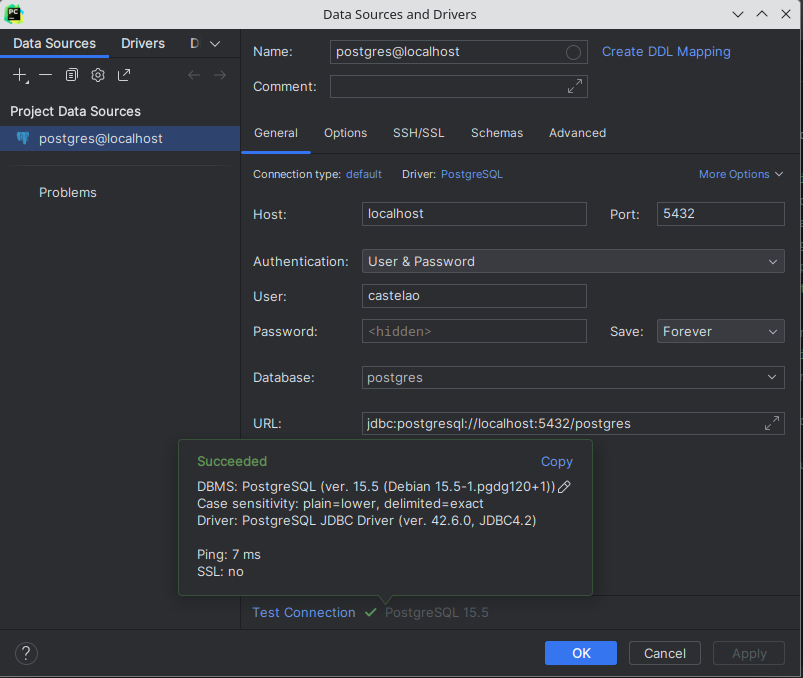
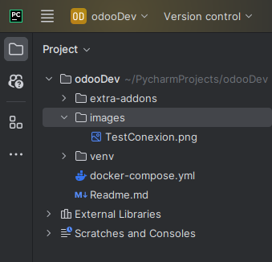
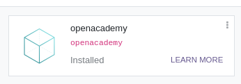
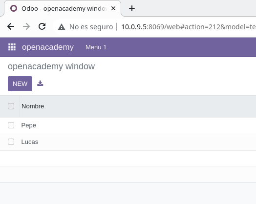

# Odoo OpenAcademy

Este repositorio consiste en la preparacion del openacademy de odoo.

## DockerCompose
En el docker tendremos un contenedor con la imagen de `odoo`.
```  
#servicio de la aplicacion
  web_dev:
    image: odoo:16.0
    #servicio de base de datos que utiliza la plicacion
    #esta aplicacion depende de este servicio
    #no arrancará hasta que el servicio este levantado
    depends_on:
      - mydb_dev
    volumes:
      - ./extra-addons:/mnt/extra-addons
    #mapeo de puertos para acceder a la aplicacion en mi maquina
    ports:
      - 8069:8069
    #variables de entorno para la aplicacion
    environment:
      #nombre o la IP del gestor de base de datos
      - HOST=mydb_dev
      # usuario (administrador del gestor de la base de datos)
      - USER=castelao
      # contraseña del ADMIN (superusuario) del gestor de base de datos
      - PASSWORD=castelao
  #servicio gestor de base de datos
  ```

Y otro con la imagen de `postgres`.
```  
#servicio gestor de base de datos
  mydb_dev:
    #imagen utilizada y su version
    image: postgres:15
    #mapeo de puertos para acceder a las bases de datos desde el IDE
    ports:
      - 5432:5432
    #variables de entorno de la imagen postgres 15
    environment:
      #nombre de la base de datos predeterminada
      - POSTGRES_DB=postgres
      #contraseña del administrador
      - POSTGRES_PASSWORD=castelao
      #usuario administrador
      - POSTGRES_USER=castelao
 ```
## Conexion con la base de datos




## Creacion del OpenAcademy

Para instalar este módulo, Lanzaremos los siguentes Comandos:

- docker exec -u root -it sxe_odoo2-web_dev-1 /bin/bash : para ingresar al contenedor de Odoo.
- cd /mnt/extra-addons : para ingresar a la carpeta 'extra-addons'.
- odoo scaffold openacademy : para crear la estructura de carpetas y archivos del módulo.
- chmod -R 777 openacademy : para dar permisos a la carpeta del módulo.

Tras lanzar los comandos podremos ver la estructura de carpetas y archivos del módulo.



## Creacion de tablas y configuracion del modulo

Para configurar el modulo debemos hacer un restart del contenedor de Odoo y tener en developer mode activado nuestro Odoo.
Posteriormente debemos ir a la pestaña de aplicaciones y buscar nuestro modulo, una vez encontrado lo instalamos.



Una vez instalado podemos crear las tablas desde nuestro IDE a la vez que las visualizamos.

Para crear una tabla, nos dirigimos a la carpeta 'models' y modificamos el archivo 'models.py'. En este archivo, se encuentra la estructura de la tabla (siendo renombrado, tabla_nombres).

```
# -*- coding: utf-8 -*-

from odoo import fields, models

class TestModel(models.Model):
    _name = "test_model"
    _description = "Modelo de prueba"

    name = fields.Char(string="Nombre")
    description = fields.Text(string="Descripcion")

```

Ahora daramos los valosres de la tabla en el archivo `datos.xml` que se encuentra en la carpeta `data`.

```
<odoo>
    <data>
        <record model="test_model" id="openacademy.nombres">
            <field name="name">Pepe</field> <!-- El nombre debe ser el mismo que la variable del modelo -->
            <field name="description">50</field> <!--El nombre debe ser el mismo que la variable del modelo-->
        </record>
    </data>
</odoo>
```
Este cambio hay que reflejarlo en el manifest para que sea efectivo.

```
    # always loaded
    'data': [
        ...
        'data/datos.xml',
        ...
    ]
```
Ahora solo fata cambiar el archivo `views.xml` para que se visualice la tabla ya creada en el modulo de Odoo.

```
<odoo>
  <data>
    <!-- explicit list view definition -->
<!--
    <record model="ir.ui.view" id="openacademy.list">
      <field name="name">openacademy list</field>
      <field name="model">openacademy.openacademy</field>
      <field name="arch" type="xml">
        <tree>
          <field name="name"/>
          <field name="value"/>
          <field name="value2"/>
        </tree>
      </field>
    </record>
-->

    <!-- actions opening views on models -->

    <record model="ir.actions.act_window" id="openacademy.action_window">
      <field name="name">openacademy window</field>
      <field name="res_model">test_model</field>
      <field name="view_mode">tree,form</field>
    </record>


    <!-- server action to the one above -->
<!--
    <record model="ir.actions.server" id="openacademy.action_server">
      <field name="name">openacademy server</field>
      <field name="model_id" ref="model_openacademy_openacademy"/>
      <field name="state">code</field>
      <field name="code">
        action = {
          "type": "ir.actions.act_window",
          "view_mode": "tree,form",
          "res_model": model._name,
        }
      </field>
    </record>
-->

    <!-- Top menu item -->

    <menuitem name="openacademy" id="openacademy.menu_root"/>

    <!-- menu categories -->

    <menuitem name="Menu 1" id="openacademy.menu_1" parent="openacademy.menu_root"/>
    <menuitem name="Menu 2" id="openacademy.menu_2" parent="openacademy.menu_root"/>

    <!-- actions -->

    <menuitem name="List" id="openacademy.menu_1_list" parent="openacademy.menu_1"
              action="openacademy.action_window"/>
<!--
    <menuitem name="Server to list" id="openacademy" parent="openacademy.menu_2"
              action="openacademy.action_server"/>
-->
  </data>
</odoo>
```
Finalmente, solo fata cambiar el archivo `security.xml`.

```
id,name,model_id:id,group_id:id,perm_read,perm_write,perm_create,perm_unlink
access_openacademy_openacademy,openacademy.openacademy,model_test_model,base.group_user,1,1,1,1

```

Y hacer un restart al contenedor y un upgrade al modulo para que se visualice la tabla ya creada en el openacademy de nuestro Odoo.



Tambien puedes crear un registor desde el mismo Odoo con el boton `new` y de visualizaria en la tabla desde nuestro IDE.