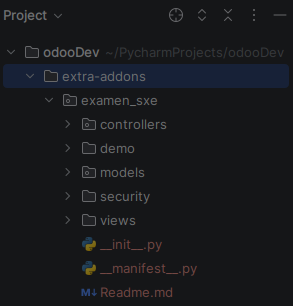
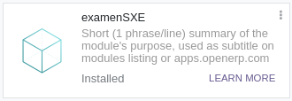
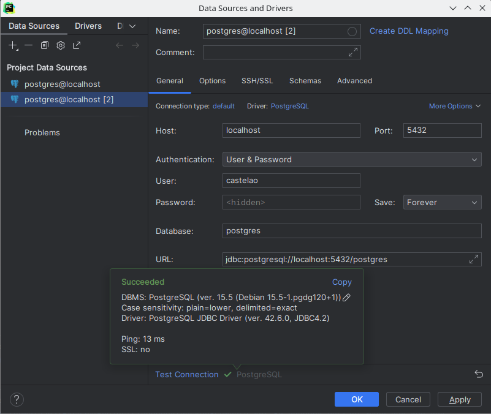

# Examen odoo

Con el odoo iniciado, crearemos un nuevo modulo llama examenSXE, en 
el tencremos que hacer una tabla con una serie de datos determinados.


## Se crea el modulo
Desde el terminal de nuestro proyecto debemos de lanzar los siguientes comandos:
1. `docker exec -u root -it odoodev-web_dev-1 /bin/bash`: este comando va a abrir el contenedor en root.
2. `cd /mnt/extra-addons/`: dentro del contenedor nos posicionamos en la carpeta que queramos.
3. `odoo scaffold examenSXE`: Muntamos la estrucuta de nuestro odoo.
4. `chmod -R 777 examen_sxe/`: le damos los permisos necesarios.



Tras eso se reinicia el contenedor y deberia de aparecer el en modulo en nuestro odoo.




## Creacion de la tabla 
Para crear una tabla, nos dirigimos a la carpeta `models` y modificamos el archivo `models.py`.
En este archivo, se encuentra la estructura de la tabla:

Despues damos los valores a la tabla en `datos.xml`

Y esto hay que añadirlo al __manifest__.py

```
    'data': [
        ...
        'data/datos.xml',
        ...
    ]
```
Por ultimo para que se muestre tenemos que cambiar le `views.xml`, con esto se deberia de visualizar en el odoo, a falta de cambiar la configuracion de la seguridad.

En el archivo `security/ir.model.access.csv` añadimos las dos siguientes lineas:

```
id,name,model_id:id,group_id:id,perm_read,perm_write,perm_create,perm_unlink
access_examenSXE_product,access_examenSXE_product,model_examenSXE_product,,1,1,1,1

```
Yo aqui estoy esperimentando un error que no consigo solucionar, por lo que no puedo mostrar la tabla en el odoo.

Tambien podemos hacer una conexion con la base de datos, desde nuestro IDE.


